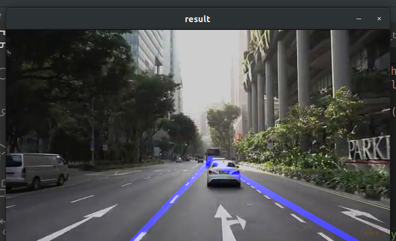

# Lane Detector using Probabilistic Hough Transform in OpenCV

This is a simple script to detect lanes using the Hough Transform method in OpenCV



## Using the script

### 1. Dependencies

Install OpenCV with pip package installer

For Linux:
```
sudo apt update
sudo apt install python3-opencv
```

For Windows:

Follow this link on how to [install](https://docs.opencv.org/master/d5/de5/tutorial_py_setup_in_windows.html)

### 2. File format of images/videos

Please use .jpg (images) or .mp4 (videos) format for testing

### 3. For debugging and custom lane detection

Use the `boundary_tester.py` script to indicate lane boundaries